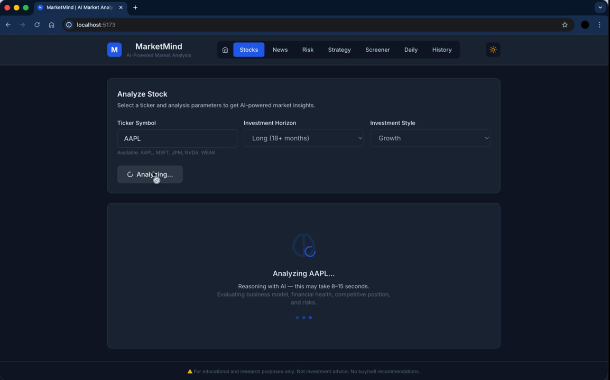
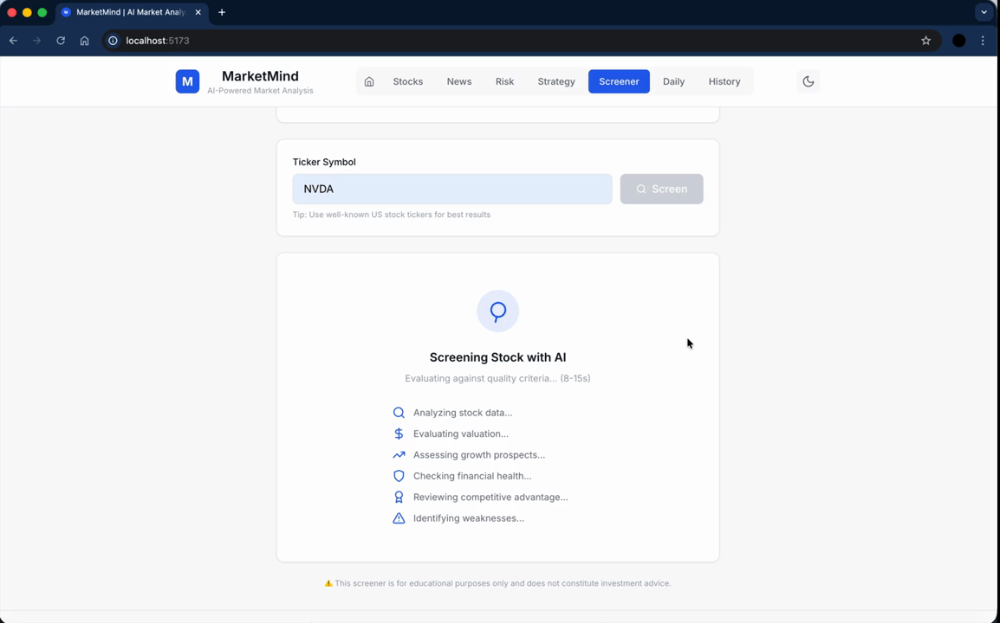

<p align="center">
  
  
  
  
  
</p>

<h1 align="center">MarketMind</h1>

<p align="center">
  <strong>AI-Powered Market Analysis Platform</strong>
</p>

<p align="center">
  A full-stack React application demonstrating advanced AI integration, complex state management, and production-ready frontend architecture.
</p>

---

## Table of Contents

- [Demo](#demo)
- [Features](#features)
- [Tech Stack](#tech-stack)
- [Architecture](#architecture)
- [Installation & Setup](#installation--setup)
- [Testing](#testing)
- [Code Quality](#code-quality)
- [Deployment](#deployment)
- [Project Structure](#project-structure)
- [Key Technical Highlights](#key-technical-highlights)
- [License](#license)
- [Author](#author)

---

## Demo

### Dashboard Overview


_Interactive dashboard showcasing seamless dark/light mode switching with system preference detection_

### Stock Analysis


_AI-powered stock analysis with structured data rendering, displaying financial health, competitive moat, and risk assessment_

### News Impact Analyzer


_Real-time news sentiment analysis with second-order effects and risk evaluation_

### Risk Profile Assessment


_Personalized risk profiling with exposure bands, time horizons, and rebalancing strategies_

### Strategy Simulator


_Trading strategy simulation showing behavior across market regimes and failure mode analysis_

### Stock Screener


_Multi-factor AI screening with pass/fail criteria and comprehensive weakness assessment_

### History Management


_localStorage-persisted analysis history with delete functionality and PDF export capability_

---

## Features

This project showcases senior frontend engineering skills with emphasis on:

- **AI Integration**: Consuming structured AI responses, handling latency, and rendering complex data
- **TypeScript Excellence**: End-to-end type safety with Zod schemas and discriminated unions
- **State Management**: Sophisticated async state handling for AI operations
- **UX Polish**: Loading states, error boundaries, offline detection, and toast notifications
- **Production Readiness**: ESLint, Prettier, Vitest, Docker, and deployment configuration

> **Note**: This is a portfolio demonstration project, not financial advice software.

### Analysis Modules

| Module             | Description                | AI Capabilities                                     |
| ------------------ | -------------------------- | --------------------------------------------------- |
| Stock Analyst      | Deep-dive company analysis | Financial health, competitive moat, risk assessment |
| News Analyzer      | News impact evaluation     | Sentiment analysis, second-order effects            |
| Risk Manager       | Portfolio risk profiling   | Exposure bands, rebalancing logic                   |
| Strategy Simulator | Trading strategy testing   | Failure modes, emotional traps                      |
| Stock Screener     | AI-driven screening        | Multi-factor pass/fail analysis                     |
| Daily Brain        | Personalized routines      | Time allocation, consistency tips                   |

### UX Features

- Dark mode with system preference detection
- Responsive design for all screen sizes
- History persistence via localStorage
- PDF export for analysis reports
- Toast notifications for user feedback
- Error boundaries for graceful failure handling
- Offline detection with connection status

---

## Tech Stack

### Frontend

| Technology      | Purpose                               |
| --------------- | ------------------------------------- |
| React 18        | UI framework with concurrent features |
| TypeScript 5    | Static typing and enhanced DX         |
| Tailwind CSS    | Utility-first styling                 |
| Vite            | Fast build tool and dev server        |
| Framer Motion   | Smooth animations                     |
| React Hook Form | Form state management                 |
| Zod             | Runtime validation and type inference |
| Recharts        | Data visualization                    |
| Axios           | HTTP client with interceptors         |

### Backend

| Technology            | Purpose             |
| --------------------- | ------------------- |
| Node.js               | Runtime environment |
| Express               | API framework       |
| Claude AI (Anthropic) | LLM for analysis    |
| Winston               | Production logging  |
| Helmet                | Security headers    |

### Development

| Tool     | Purpose                    |
| -------- | -------------------------- |
| Vitest   | Unit and component testing |
| ESLint   | Code linting               |
| Prettier | Code formatting            |
| Docker   | Containerization           |

---

## Architecture

### Frontend-AI Integration Flow

```
┌─────────────────────────────────────────────────────────────────┐
│                        FRONTEND (React)                         │
├─────────────────────────────────────────────────────────────────┤
│                                                                 │
│  ┌──────────────┐    ┌──────────────┐    ┌──────────────────┐   │
│  │  Form Input  │ => │  Zod Schema  │ => │  API Client      │   │
│  │  (RHF)       │    │  Validation  │    │  (Axios + Types) │   │
│  └──────────────┘    └──────────────┘    └────────┬─────────┘   │
│                                                   │             │
│  ┌──────────────────────────────────────────────────────────┐   │
│  │                    STATE MACHINE                         │   │
│  │  idle → loading → success/error                          │   │
│  │  (Discriminated Union Pattern)                           │   │
│  └──────────────────────────────────────────────────────────┘   │
│                            ↓                                    │
│  ┌──────────────┐    ┌──────────────┐    ┌──────────────────┐   │
│  │ LoadingState │    │ ErrorState   │    │ ResultsCards     │   │
│  │ (8-15s wait) │    │ (Retry UX)   │    │ (Structured AI)  │   │
│  └──────────────┘    └──────────────┘    └──────────────────┘   │
│                                                                 │
└─────────────────────────────────────────────────────────────────┘
                              ↓ HTTP
┌─────────────────────────────────────────────────────────────────┐
│                       BACKEND (Express)                         │
├─────────────────────────────────────────────────────────────────┤
│  Request → Zod Validation → Claude AI → Schema Parse → Response │
└─────────────────────────────────────────────────────────────────┘
```

### State Management Pattern

```typescript
// Discriminated union for exhaustive type checking
type PageState =
  | { status: 'idle' }
  | { status: 'loading'; ticker: string }
  | { status: 'success'; response: AnalysisResponse }
  | { status: 'error'; message: string };

// TypeScript enforces handling all states
switch (state.status) {
  case 'idle': return <Form />;
  case 'loading': return <LoadingState ticker={state.ticker} />;
  case 'success': return <Results data={state.response} />;
  case 'error': return <ErrorState message={state.message} />;
}
```

---

## Installation & Setup

### Prerequisites

- Node.js 18+ (20 recommended)
- npm or yarn
- [Anthropic API Key](https://console.anthropic.com/)

### Installation

```bash
# Clone the repository
git clone https://github.com/yourusername/marketReasoner.git
cd marketReasoner

# Install backend dependencies
npm install

# Install frontend dependencies
cd client && npm install && cd ..

# Configure environment
cp .env.example .env
# Edit .env and add your ANTHROPIC_API_KEY
```

### Development

```bash
# Run both frontend and backend
npm run dev:all

# Or run separately:
npm run dev:server   # Backend on :4000
cd client && npm run dev  # Frontend on :5173
```

### Access Points

- **Frontend**: http://localhost:5173
- **API Health**: http://localhost:4000/api/health
- **API Status**: http://localhost:4000/api/status

---

## Testing

### Frontend Tests

```bash
cd client

# Run tests in watch mode
npm run test

# Run tests once
npm run test:run

# Run with UI
npm run test:ui
```

### Test Coverage

Tests focus on AI integration scenarios:

- Rendering structured AI responses
- Loading state messaging (8-15s wait times)
- Error handling and retry functionality
- Form validation with Zod schemas
- State transitions (idle → loading → success/error)

---

## Code Quality

### Linting & Formatting

```bash
cd client

# Run ESLint
npm run lint

# Fix ESLint issues
npm run lint:fix

# Format with Prettier
npm run format

# Check formatting
npm run format:check

# TypeScript check
npm run typecheck
```

### ESLint Configuration

- React best practices
- TypeScript strict mode
- Import organization
- Accessibility (jsx-a11y)
- Prettier integration

---

## Deployment

### Docker

```bash
# Build image
docker build -t marketmind .

# Run container
docker run -p 4000:4000 --env-file .env marketmind

# Or use docker-compose
docker-compose up -d
```

### Vercel (Frontend)

```bash
cd client
npm run deploy:preview
```

### Environment Variables

| Variable            | Required | Description              |
| ------------------- | -------- | ------------------------ |
| `ANTHROPIC_API_KEY` | Yes      | Claude AI API key        |
| `NODE_ENV`          | No       | development/production   |
| `PORT`              | No       | API port (default: 4000) |
| `FRONTEND_ORIGIN`   | No       | CORS origin              |

---

## Project Structure

```
marketReasoner/
├── client/                      # React Frontend
│   ├── src/
│   │   ├── api/                 # Typed API client
│   │   │   └── client.ts        # Axios + error handling
│   │   ├── components/
│   │   │   ├── form/            # Form components
│   │   │   ├── results/         # AI response cards
│   │   │   └── states/          # Loading/Error states
│   │   ├── hooks/               # Custom React hooks
│   │   ├── pages/               # Route components
│   │   ├── test/                # Test utilities & mocks
│   │   ├── types/               # TypeScript definitions
│   │   └── utils/               # Helpers (storage, etc.)
│   ├── .eslintrc.cjs            # ESLint configuration
│   ├── .prettierrc              # Prettier configuration
│   └── vite.config.ts           # Vite + Vitest config
│
├── src/                         # Node.js Backend
│   ├── config/                  # Environment validation
│   ├── llm/                     # AI client abstraction
│   ├── prompts/                 # Claude system prompts
│   ├── schemas/                 # Zod output schemas
│   ├── services/                # Business logic
│   └── server.ts                # Express API
│
├── Dockerfile                   # Production container
├── docker-compose.yml           # Local orchestration
└── package.json                 # Root scripts
```

---

## Key Technical Highlights

### AI Response Handling

- 60-second timeout for LLM operations
- Structured error messages from API failures
- Confidence levels displayed for all AI outputs

### Type Safety

- Zod schemas shared between validation and types
- Discriminated unions for state management
- Type-inferred API responses

### Performance

- Code splitting with manual chunks (vendor, UI, charts)
- Terser minification for production
- Optimized dependency pre-bundling

### UX Polish

- Skeleton loading with AI processing messaging
- Toast notifications for user feedback
- localStorage persistence for history

---

## License

This project is [MIT](LICENSE) licensed.

---

## Author

**Lucas Brinton**

[](https://twitter.com/LucasBrinton1)
[](https://www.linkedin.com/in/lucas-brinton-52aa32174/)

**Contact:** [lucasbrintondev@gmail.com](mailto:lucasbrintondev@gmail.com)

---

<p align="center">
  <strong>Built with ❤️ to demonstrate modern frontend engineering skills</strong>
</p>
